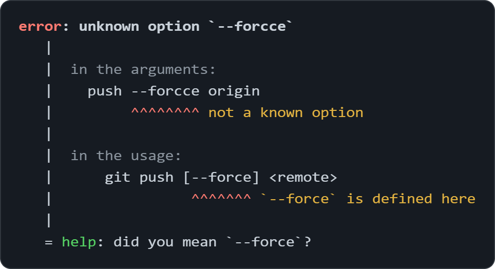
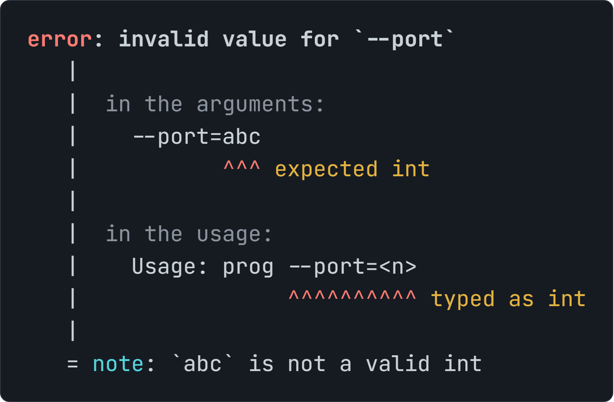
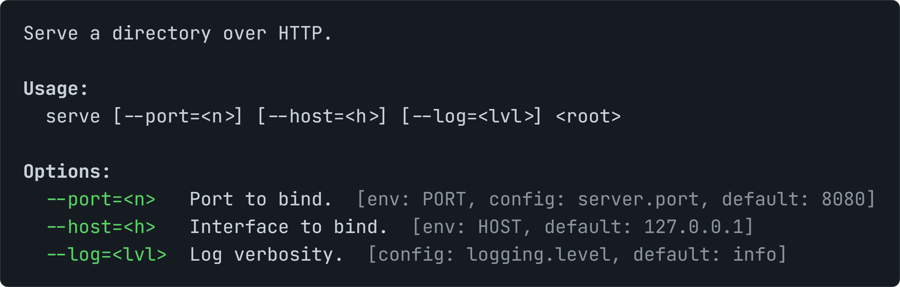
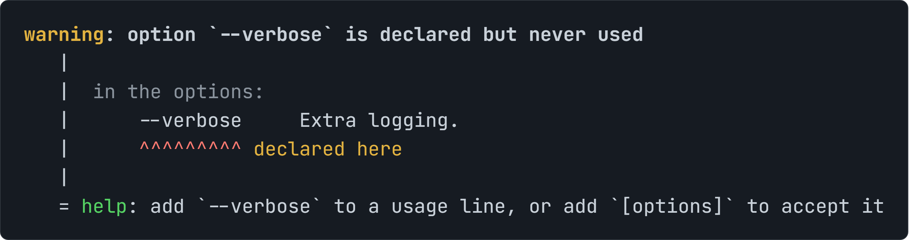

<p align="center">
  <picture>
    <source media="(prefers-color-scheme: dark)" srcset="docs/assets/logo-dark.png">
    <source media="(prefers-color-scheme: light)" srcset="docs/assets/logo.png">
    
  </picture>
  <br>
  <b>Typed successor to docopt. The usage message is the parser spec.</b>
  <br>
  A drop-in replacement for <a href="https://github.com/docopt/docopt">docopt</a> - a superset, not a rewrite.
</p>

<p align="center">
  <a href="https://github.com/Solganis/docopt2/actions/workflows/ci.yml"></a>
  <a href="https://pypi.org/project/docopt2/"></a>
  <a href="https://pypi.org/project/docopt2/"></a>
  <a href="https://codecov.io/gh/Solganis/docopt2"></a>
  <br>
  <a href="https://solganis.github.io/docopt2/"></a>
  <a href="https://docs.astral.sh/ruff/"></a>
  <a href="https://github.com/astral-sh/uv"></a>
  <a href="https://github.com/astral-sh/ty"></a>
  <a href="https://scorecard.dev/viewer/?uri=github.com/Solganis/docopt2"></a>
  <br>
  
  
</p>

---

<h2 align="center">Features</h2>

<table>
<tr>
<td valign="top" width="50%">
<a href="#typed-results"><b>Typed results</b></a><br>
Pass a schema, get a typed result back - fields coerced to their types, never a <code>dict[str, Any]</code>.
</td>
<td valign="top" width="50%">
<a href="#diagnostics"><b>Rustc-style diagnostics</b></a><br>
Errors point at the mistake: colored carets in your argv and the usage, plus the closest usage line.
</td>
</tr>
<tr>
<td valign="top">
<a href="#subcommand-dispatch"><b>Subcommand dispatch</b></a><br>
Route each subcommand to its own handler - no <code>if args[...]</code> ladder.
</td>
<td valign="top">
<a href="#shell-completion"><b>Shell completion</b></a><br>
Tab-completion that knows your grammar: bash, zsh, fish, PowerShell.
</td>
</tr>
<tr>
<td valign="top">
<a href="#schema-codegen"><b>Schema codegen</b></a><br>
Never hand-write the schema - <code>docopt2 stub</code> generates it from your usage, in three styles.
</td>
<td valign="top">
<a href="#layered-fallback"><b>Layered fallback</b></a><br>
Resolve an option from <code>[env: VAR]</code> or <code>[config: key]</code> - CLI, then env, then config, then default.
</td>
</tr>
<tr>
<td valign="top">
<a href="#rich-help"><b>Self-documenting <code>--help</code></b></a><br>
Opt into a colored, scoped help that shows where each value resolves from - env, config, default.
</td>
<td valign="top">
<a href="#usage-linter"><b>Static usage linter</b></a><br>
Catch a broken usage before it ships - <code>docopt2 check</code> flags dead defaults and unusable options.
</td>
</tr>
<tr>
<td valign="top">
<a href="#example-generation"><b>Example generation</b></a><br>
Sample every argv your usage accepts - for drift detection, fuzzing, and a Hypothesis strategy.
</td>
<td valign="top">
<a href="#round-trip"><b>Round-trip codec</b></a><br>
Turn a parsed result back into an argv that parses to it - <code>format_argv</code>, the inverse of <code>docopt</code>.
</td>
</tr>
</table>

<h2 align="center"><a href="https://solganis.github.io/docopt2/getting-started/">Quick start</a></h2>

```bash
pip install docopt2  # just change the import
```

```python
"""Naval Fate.

Usage:
  naval ship new <name>...
  naval ship <name> move <x> <y> [--speed=<kn>]
  naval --help

Options:
  --speed=<kn>  Speed in knots [default: 10].
"""
from docopt2 import docopt

args = docopt(__doc__)
# args is a dict: {"ship": True, "<name>": ["titanic"], "move": True, "--speed": "10", ...}
```

Every argument vector the original docopt accepts, docopt2 accepts identically -<br>
so switching over is a one-line import change, and everything else is opt-in.

<h2 align="center"><a href="https://solganis.github.io/docopt2/guides/usage-dsl/">Usage syntax</a></h2>

docopt2 reads the same usage DSL as docopt - the `Usage:` and `Options:` blocks *are* the spec.

<table align="center">
<tr><th>Syntax</th><th>Meaning</th></tr>
<tr><td><code>command</code></td><td>A literal (sub)command, matched as-is.</td></tr>
<tr><td><code>&lt;arg&gt;</code>, <code>ARG</code></td><td>A positional argument.</td></tr>
<tr><td><code>-o</code>, <code>--option</code></td><td>An option (flag).</td></tr>
<tr><td><code>--option=&lt;val&gt;</code></td><td>An option that takes a value.</td></tr>
<tr><td><code>[ ]</code></td><td>Optional element(s).</td></tr>
<tr><td><code>( )</code></td><td>Required group.</td></tr>
<tr><td><code>a | b</code></td><td>Mutually exclusive: choose one.</td></tr>
<tr><td><code>element...</code></td><td>Repeatable: one or more.</td></tr>
<tr><td><code>[options]</code></td><td>Stands in for every option listed under <code>Options:</code>.</td></tr>
<tr><td><code>--</code></td><td>Ends option parsing; the rest is positional.</td></tr>
<tr><td><code>[default: &lt;val&gt;]</code></td><td>An option's default value, declared under <code>Options:</code>.</td></tr>
<tr><td><code>[env: &lt;var&gt;]</code></td><td>An option's environment-variable fallback.</td></tr>
<tr><td><code>[config: &lt;key&gt;]</code></td><td>An option's config-file fallback (CLI &gt; env &gt; config &gt; default).</td></tr>
</table>

The legend covers the essentials; the [full usage grammar](https://solganis.github.io/docopt2/guides/usage-dsl/) - precedence, edge cases, and how each form maps to the parsed result - lives on the site.

<a name="typed-results"></a>
<h2 align="center"><a href="https://solganis.github.io/docopt2/guides/typed-results/">Why typed docopt?</a></h2>

**docopt** hands you a dict of strings - no autocomplete, no static types, coercion by hand at every call site:

```python
args = docopt("Usage: app <host> <port> [--verbose]")
host = args["<host>"]        # unchecked, a bare string
port = int(args["<port>"])   # coerce by hand, at every call site
```

**docopt2** takes a schema and gives you a typed result back:

```python
@dataclasses.dataclass
class Args:
    host: str
    port: int                  # coerced from the parsed string
    verbose: bool

args = docopt("Usage: app <host> <port> [--verbose]", schema=Args)
args.port                      # statically an int, not a string
```

A dataclass, a `TypedDict`, the `Cli` base class, or a pydantic model all work as `schema=` -<br>
and you don't hand-write it, `docopt2 stub` generates it from the usage.

<a name="diagnostics"></a>
<h2 align="center"><a href="https://solganis.github.io/docopt2/guides/diagnostics/">Diagnostics that point at the problem</a></h2>

When the arguments don't match, **docopt** reprints the usage and leaves you to find the mistake:

```text
Usage:
  git commit [--message=<msg>] [--amend]
  git push [--force] <remote>
```

**docopt2** [points at it](https://solganis.github.io/docopt2/guides/diagnostics/#a-mismatch-at-parse-time) - in the argv *and* the usage that rejected it:

<p align="center">
  
</p>

The same two carets flag a [malformed usage](https://solganis.github.io/docopt2/guides/diagnostics/#a-malformed-usage-at-import-time) at import time - a broken spec fails loudly, not silently - and [a value that will not coerce](https://solganis.github.io/docopt2/guides/diagnostics/#a-value-that-does-not-fit-its-type) to its typed field:

<p align="center">
   in the usage, plus 'help: abc is not a valid int'">
</p>

**[Closest usage line.](https://solganis.github.io/docopt2/guides/diagnostics/#the-usage-line-you-were-closest-to)** When several invocations are possible, docopt2 finds the one you got furthest into and carets the single element it still needs - not a generic "no match".

<a name="subcommand-dispatch"></a>
<h2 align="center"><a href="https://solganis.github.io/docopt2/guides/dispatch/">Subcommand dispatch</a></h2>

`Dispatch` routes each command to its own handler - no `if args["..."]` ladder:

```python
from docopt2 import Dispatch

app = Dispatch("""Usage:
  git add <path>...
  git commit --message=<msg>
""")

@app.on("add")
def add(args):
    print(f"adding {args['<path>']}")

@app.on("commit")
def commit(args):
    print(f"committing {args['--message']!r}")

app.run()   # parse argv, call the matched command's handler
```

<a name="shell-completion"></a>
<h2 align="center"><a href="https://solganis.github.io/docopt2/guides/completion/">Shell completion</a></h2>

<p align="center">
  <a href="https://www.gnu.org/software/bash/"></a>
  <a href="https://www.zsh.org/"></a>
  <a href="https://fishshell.com/"></a>
  <a href="https://learn.microsoft.com/powershell/"></a>
</p>

Generate the completion script for your shell; Tab then narrows to exactly what is valid at the cursor -<br>
commands and options, never positional values - straight from the usage:

```console
$ naval <TAB>
--help  --speed  ship
$ naval ship <TAB>
--speed  new
$ naval ship titanic move 1 2 <TAB>
--speed
```

<a name="schema-codegen"></a>
<h2 align="center"><a href="https://solganis.github.io/docopt2/guides/stub/">Generate the schema from the usage</a></h2>

Don't hand-write the schema - `docopt2 stub` generates it from your usage (a module docstring, a text file, or stdin):

```console
$ docopt2 stub naval.py
```

```python
@dataclasses.dataclass
class Args:
    ship: bool
    new: bool
    name: list[str]
    move: bool
    x: str | None
    y: str | None
    speed: str
    help: bool
```

Add `--style=typeddict` or `--style=cli` for the other shapes.<br>
Widen a field by hand (`speed: int`) and the coercion is automatic.

<a name="layered-fallback"></a>
<h2 align="center"><a href="https://solganis.github.io/docopt2/guides/usage-dsl/#environment-and-config-fallback">Layered value resolution</a></h2>

Declare an option's fallback sources in the usage with `[env: VAR]` and `[config: key]`; docopt2 resolves each -<br>
the command-line argument first, then the environment, then a config mapping you pass, then the `[default: ...]`:

```python
doc = "Usage: prog [--port=<n>]\n\nOptions:\n  --port=<n>  Port [default: 80] [env: APP_PORT] [config: server.port]."

docopt(doc, "", config={"server": {"port": 8080}})             # {'--port': '8080'} - config
os.environ["APP_PORT"] = "7000"
docopt(doc, "", config={"server": {"port": 8080}})             # {'--port': '7000'} - env wins
docopt(doc, "--port=9000", config={"server": {"port": 8080}})  # {'--port': '9000'} - CLI wins
```

docopt2 never reads the file - you load it however you like (TOML, JSON, a `[tool.<prog>]` table) and pass the mapping, so you are never tied to one format.

**[Know where a value came from.](https://solganis.github.io/docopt2/guides/typed-results/#where-a-value-came-from)** `args.source(name)` reports the layer that actually won - so you can log or branch on provenance instead of guessing:

```python
docopt(doc, "--port=9000", config={"server": {"port": 8080}}).source("--port")   # Source.CLI
```

**[Scaffold the config file from your usage.](https://solganis.github.io/docopt2/guides/usage-dsl/#generate-a-config-skeleton)** `docopt2 config-template` writes a ready-to-fill TOML skeleton - every `[config: key]`, seeded with its default:

```console
$ docopt2 config-template app.py
[server]
port = 80  # --port, env APP_PORT
```

<a name="rich-help"></a>
<h2 align="center"><a href="https://solganis.github.io/docopt2/guides/help/">Self-documenting <code>--help</code></a></h2>

`--help` prints your usage verbatim by default. Opt into `help_style="rich"` for an aligned, colored screen that also<br>
documents **where each value resolves from** - the `[env, config, default]` chain no other CLI library surfaces in its help:

<p align="center">
  
</p>

Because the sources are declared right in the usage text, the help writes itself. It also scopes to the subcommand the user typed - `git commit --help` shows only `commit`.

<a name="usage-linter"></a>
<h2 align="center"><a href="https://solganis.github.io/docopt2/guides/check/">Lint the usage before it ships</a></h2>

`docopt2 check` (or `docopt2.check(doc)` in code) lints the usage grammar itself -<br>
catching defects the parser would otherwise accept in silence:

<p align="center">
  
</p>

It flags dead `[default: ...]` values, options declared but never usable,<br>
ambiguous variadic positionals, and redundant alternatives.

<a name="example-generation"></a>
<h2 align="center"><a href="https://solganis.github.io/docopt2/guides/examples/">Sample the invocations your usage accepts</a></h2>

`docopt2 examples` (or `generate_examples`) walks the usage grammar into concrete invocations it accepts -<br>
derived from the spec, so they cannot drift from what `docopt` parses:

```console
$ docopt2 examples naval.py --count=4 --seed=5
--help
ship v1 move v2 v3
ship new v4 v5
ship new v6
```

Golden-file them to catch grammar drift, fuzz your parser with the accepted set, or add `--invalid` for the reject-set.

**[Property-test with Hypothesis.](https://solganis.github.io/docopt2/guides/examples/#property-testing-with-hypothesis)** The same sampler is a shrinking [Hypothesis](https://hypothesis.readthedocs.io/) strategy - every draw is an argv your usage accepts.

<a name="round-trip"></a>
<h2 align="center"><a href="https://solganis.github.io/docopt2/guides/round-trip/">Round-trip: results back to argv</a></h2>

`docopt` parses an argv into a result; `format_argv` does the inverse - the same usage message drives *both* directions:

```python
doc = "Usage: prog <src> <dst> [--force]"
args = docopt(doc, "a b --force")
format_argv(args, doc)   # ['a', 'b', '--force'] - which docopt parses straight back to args
```

It emits exactly what was provided and verifies each candidate by re-parsing, so `docopt(format_argv(x)) == x` always holds -<br>
a round-trip for reproducible commands, safe subprocess argv, and property tests.

---

<p align="center">
  <a href="https://github.com/Solganis/docopt2/blob/main/LICENSE">MIT License</a> ·
  derived from docopt · see
  <a href="https://github.com/Solganis/docopt2/blob/main/NOTICE">NOTICE</a>
</p>
